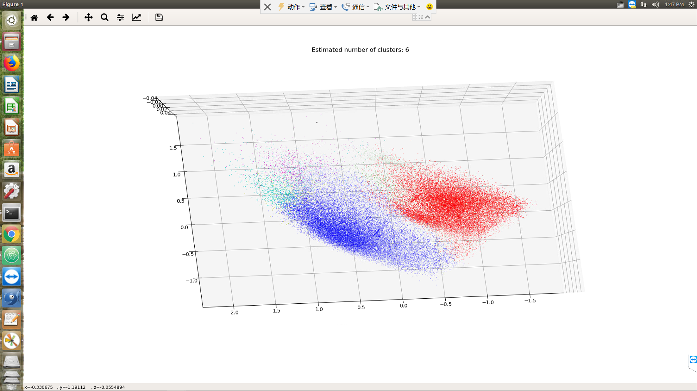
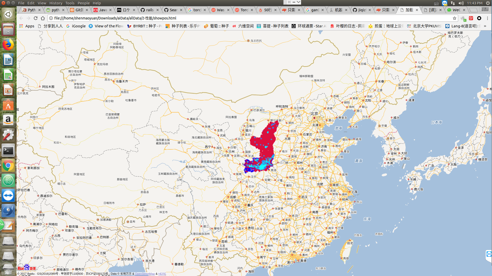
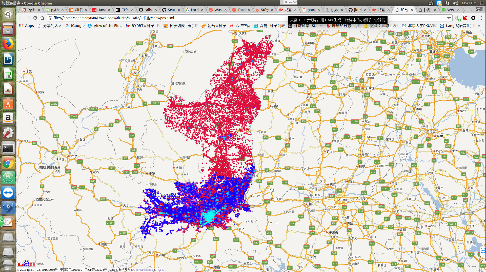
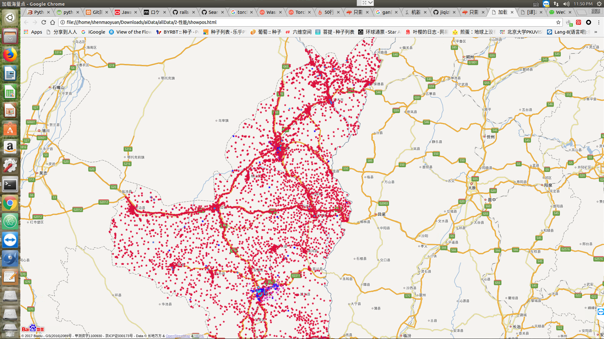
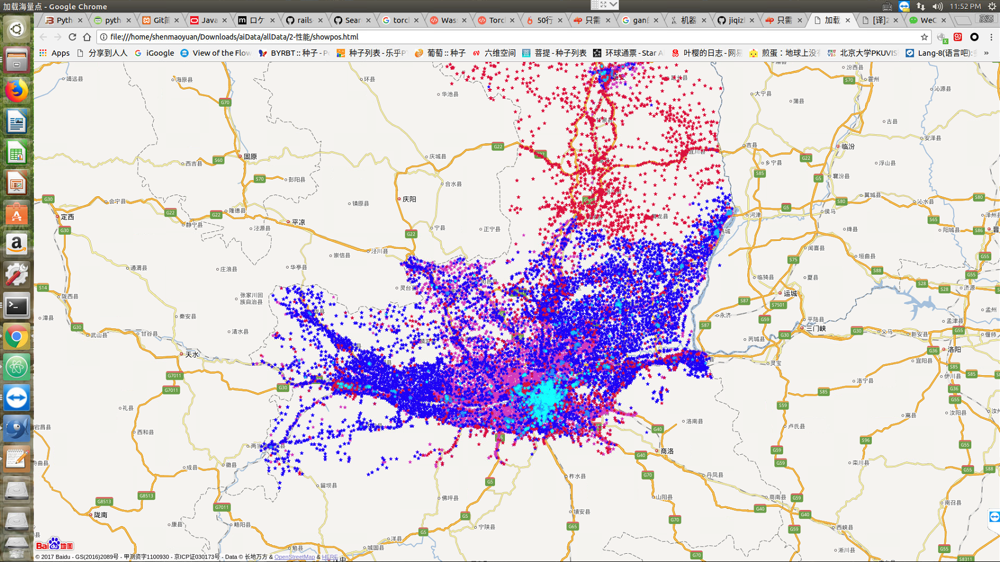
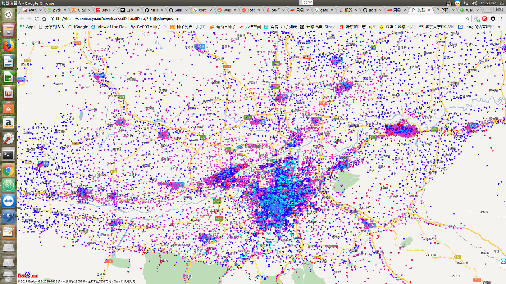
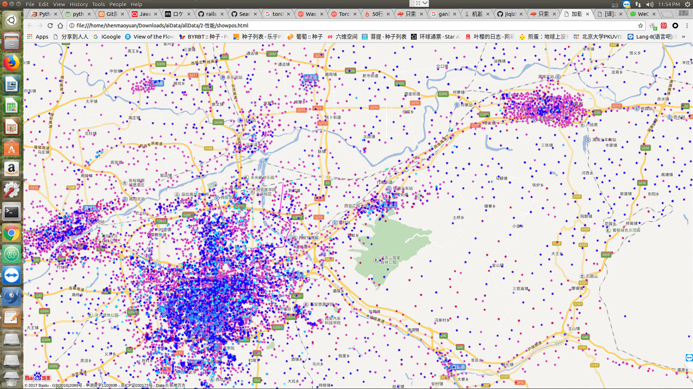
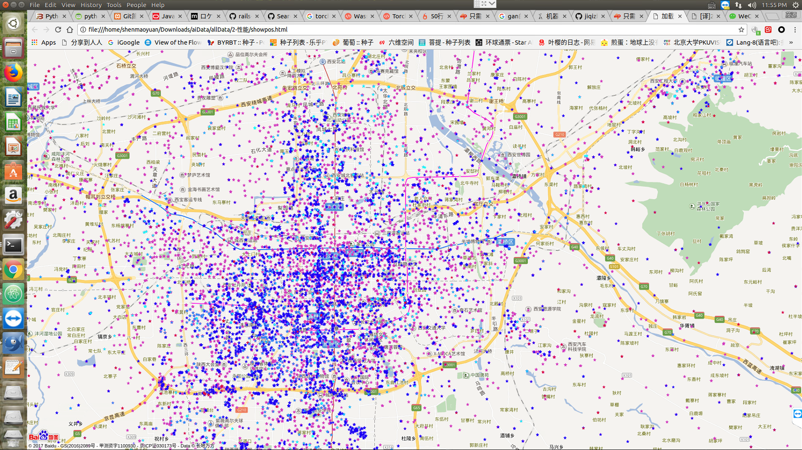
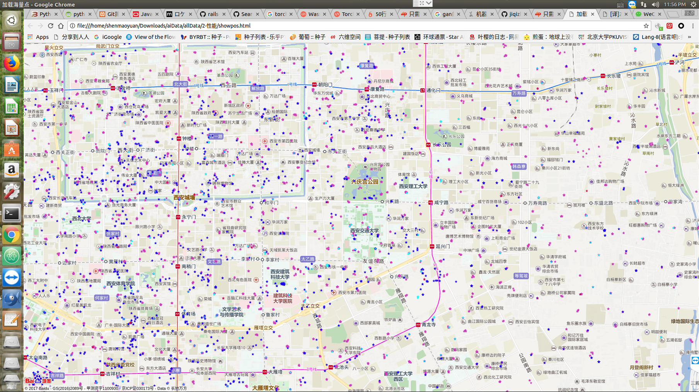
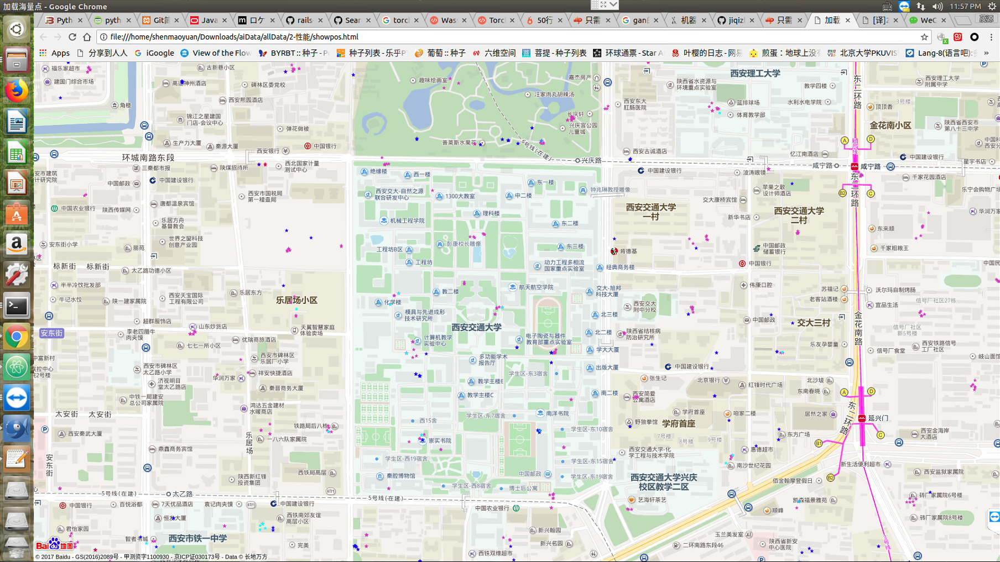

# BaseStation
PCA降维显示meanshift聚类后的6个簇分布情况：

  
  
PCA reduced dimension display.

  
  
PCA reduced dimension display.

把聚类好的6种基站在地图上显示:

  
  

  
  

  
  

  
  

  
  

  
  

  
  

  
  

  
  

